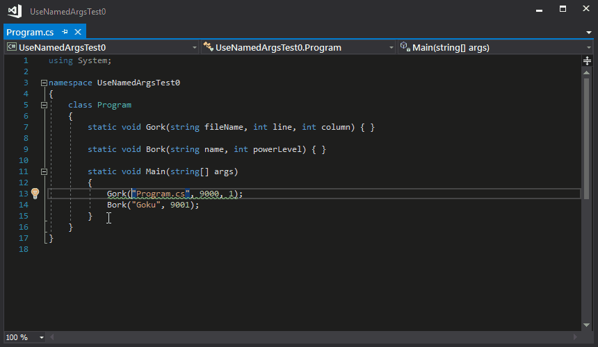

# Use named arguments for invocations of methods with multiple parameters of the same type.
This is work in progress...

# Thank you!

- [Dustin Campbell](https://github.com/DustinCampbell) for [CSharpEssentials](https://github.com/DustinCampbell/CSharpEssentials)

# License

The [UseNamedArguments](https://github.com/mykolav/use-named-arguments) analyzer and code-fix are licensed under the MIT license.  
So they can be used freely in commercial applications.
